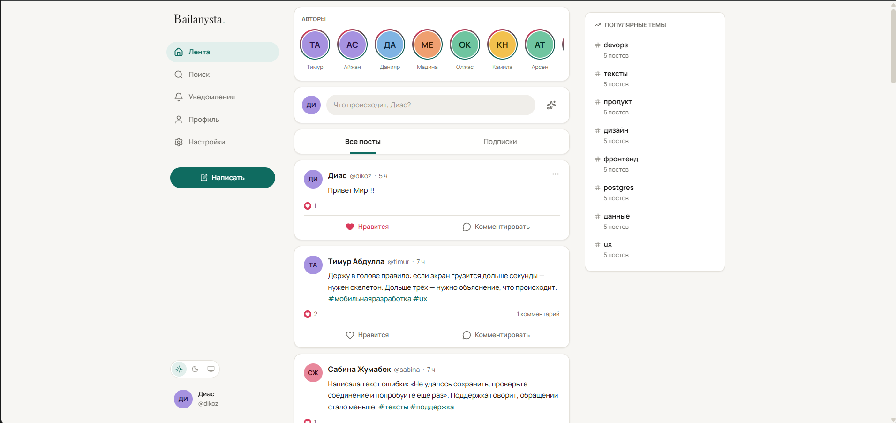
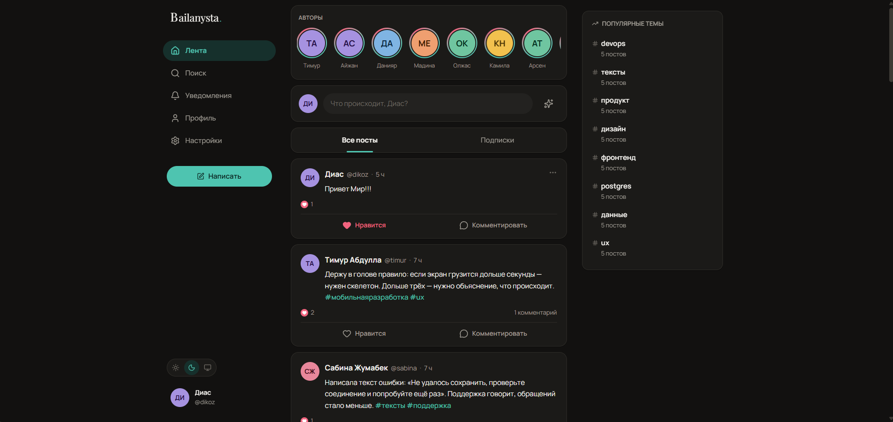
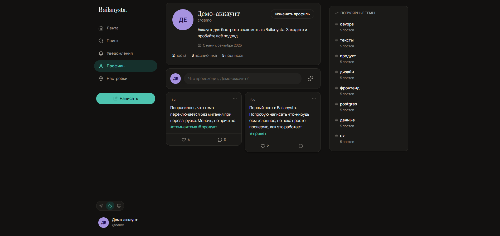
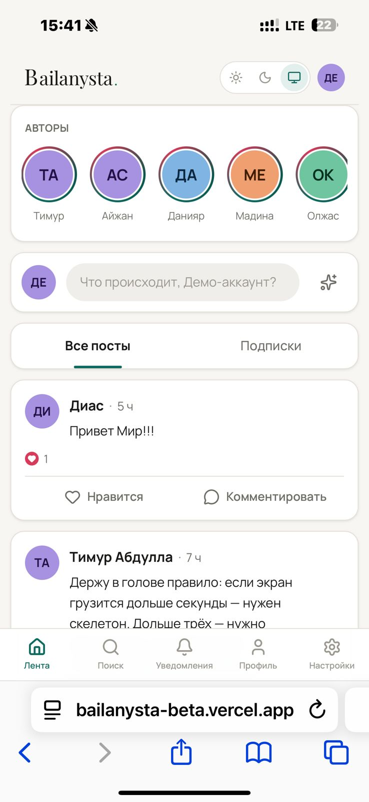

# Bailanysta

Социальная сеть: лента постов, профили, подписки, лайки, комментарии, поиск
по темам и AI-помощник для написания текстов.

«Байланыс» по-казахски — связь. Отсюда и название, и главная мысль проекта:
показать не набор фич, а связную систему, где каждое решение объяснимо.

**Живой пример:** [bailanysta-beta.vercel.app](https://bailanysta-beta.vercel.app)

**Демо-вход:** `demo@bailanysta.kz` / `demo12345` — или кнопка
«Войти как демо-пользователь» на странице входа. Демо-аккаунт уже наполнен
постами, подписками и уведомлениями.

---

## Как это выглядит

| Лента, светлая тема | Лента, тёмная тема |
| --- | --- |
|  |  |

| Профиль | Мобильная версия |
| --- | --- |
|  |  |

---

## Содержание

- [Как это выглядит](#как-это-выглядит)
- [Что умеет](#что-умеет)
- [Стек и почему именно он](#стек-и-почему-именно-он)
- [Установка и запуск](#установка-и-запуск)
- [Структура проекта](#структура-проекта)
- [API](#api)
- [Модель данных](#модель-данных)
- [Как это проектировалось](#как-это-проектировалось)
- [Решения, которыми стоит похвастаться](#решения-которыми-стоит-похвастаться)
- [Компромиссы](#компромиссы)
- [Известные проблемы и ограничения](#известные-проблемы-и-ограничения)
- [Что дальше](#что-дальше)

---

## Что умеет

**Уровень 1**
- Профиль пользователя с возможностью писать посты
- Лента постов с автором, текстом, временем и счётчиками
- Трёхслойное дерево компонентов (описано [ниже](#структура-проекта))

**Уровень 2**
- Собственный REST API `/api/v1/*` — 20 эндпоинтов, документирован [ниже](#api)
- Роутинг между экранами: лента, профиль, пост, поиск, тема, уведомления, настройки

**Уровень 3**
- Готово к деплою на Vercel + Neon (инструкция в разделе [Деплой](#деплой))

**Бонусы — сделаны все шесть**
1. **Тёмная тема** с сохранением выбора и без мигания при загрузке
2. **Лайки и комментарии** с оптимистичным обновлением
3. **Расширенная соцсеть**: создание, редактирование и удаление постов;
   подписки; уведомления о лайках, комментариях и новых подписчиках
4. **AI-помощник** на Anthropic Claude: черновик по теме, улучшение текста,
   подбор хэштегов
5. **Скелетоны и лоадеры** под геометрию реального контента
6. **Поиск** по постам, людям и хэштегам + страницы тем и блок «в тренде»

**Сверх задания**
- Регистрация и вход со своей JWT-авторизацией
- Курсорная (keyset) пагинация вместо `OFFSET`
- Полная адаптивность: три колонки на десктопе, нижняя панель на мобильном
- Доступность: навигация с клавиатуры, `aria-*`, видимый фокус,
  уважение к `prefers-reduced-motion`
- Демо-аккаунт и seed с осмысленным контентом

---

## Стек и почему именно он

| Слой | Выбор | Почему именно так |
| --- | --- | --- |
| Фреймворк | **Next.js 16** (App Router), **React 19** | Фронтенд и бэкенд в одном репозитории. Требование ТЗ «внешние сервисы вызываются с серверной части» выполняется **архитектурно**, а не силой воли: код в `src/server/` физически не попадает в клиентский бандл. Плюс SSR — первый экран приходит с данными, а не с пустым `<div id="root">`. |
| Язык | **TypeScript**, `strict` | Схема БД → типы Prisma → DTO → пропсы компонентов: если поле переименовано, проект не собирается. На проекте в 115 файлов это дешевле любых тестов. |
| Стили | **Tailwind CSS 4** + свои токены на CSS-переменных | Tailwind 4 читает токены прямо из CSS-переменных, поэтому переключение темы не требует ни JS, ни пересборки классов — меняется одна переменная на `<html>`. |
| БД | **PostgreSQL** | Нужны транзакции (счётчики лайков), частичные индексы, полнотекстовый и триграммный поиск. В SQLite последних двух нет, и поиск пришлось бы делать перебором. |
| ORM | **Prisma 7** | Типобезопасность до уровня отдельного поля, миграции в git, декларативные индексы — включая GIN с `gin_trgm_ops`, который обычно приходится дописывать сырым SQL. |
| Авторизация | **Своя**: `jose` (JWT) + `bcryptjs` | Сознательно не NextAuth. Задание проверяет умение писать бэкенд — а подключённая библиотека авторизации показывает только умение читать её README. Здесь видно всё: хеширование, подпись, кука, middleware. |
| Валидация | **Zod 4** | Одна схема используется и в форме, и в route handler. Правила физически не могут разойтись между клиентом и сервером. |
| Клиентское состояние | **TanStack Query 5** | Кэш, бесконечная прокрутка, оптимистичные мутации с откатом. Redux здесь был бы лишним: почти всё состояние — это серверные данные, а не состояние приложения. |
| AI | **Anthropic Claude** (`claude-opus-5`) | Вызывается только из route handler, ключ живёт в переменных окружения сервера. |
| Тесты | **Vitest** | Точечно на чистую логику (курсоры, хэштеги, склонения) — там, где ошибка не видна глазом. |

Версии на момент разработки: Next 16.3.3, React 19.2.8, Prisma 7.10.0,
Zod 4.5.4, TanStack Query 5.102.8, Node 24.

### Почему API отдельный, а не только Server Actions

Server Actions удобнее для форм, но их нельзя вызвать снаружи. Здесь сделан
полноценный REST: его можно дёрнуть из `curl`, открыть в Postman и использовать
из будущего мобильного клиента без единой правки на сервере. Server Components
при этом никуда не делись — первую страницу ленты они получают **напрямую из
сервисного слоя**, минуя собственный HTTP-запрос:

```ts
// src/app/(main)/page.tsx — тот же код, что и в /api/v1/posts, но без сетевого прыжка
const initialPage = await listPosts({ feed: "global", limit: PAGE_SIZE }, viewerId);
```

---

## Установка и запуск

### Требования

- Node.js 20.19+ (разрабатывалось на 24)
- PostgreSQL — либо локальный, либо облачный (Neon, Supabase)

### 1. Установить зависимости

```bash
npm install
```

### 2. Поднять базу данных

Проще всего — встроенный локальный Postgres от Prisma, ничего ставить не нужно:

```bash
npm run db:dev
```

Команда запустит сервер и напечатает `DATABASE_URL` и `SHADOW_DATABASE_URL`.
Оставьте её работать в отдельном терминале.

Альтернатива — свой Postgres или Neon: просто возьмите готовую строку подключения.

### 3. Настроить переменные окружения

```bash
cp .env.example .env
```

Заполните `.env`:

| Переменная | Обязательна | Назначение |
| --- | --- | --- |
| `DATABASE_URL` | да | Строка подключения к PostgreSQL |
| `SHADOW_DATABASE_URL` | только для локальных миграций | Нужна `prisma migrate dev`; в проде не требуется |
| `JWT_SECRET` | да | Секрет подписи токенов, минимум 32 символа |
| `ANTHROPIC_API_KEY` | нет | Без него AI-эндпоинты отвечают `503`, остальное работает |
| `ANTHROPIC_MODEL` | нет | По умолчанию `claude-opus-5` |

Сгенерировать секрет:

```bash
node -e "console.log(require('crypto').randomBytes(48).toString('base64'))"
```

### 4. Применить схему и наполнить базу

```bash
npm run db:migrate
```

```bash
npm run db:seed
```

Seed создаёт 10 пользователей, 46 постов, лайки, комментарии, подписки
и уведомления. Все демо-аккаунты имеют пароль `demo12345`.

### 5. Запустить

```bash
npm run dev
```

Приложение — на [http://localhost:3000](http://localhost:3000).

### Полезные команды

| Команда | Что делает |
| --- | --- |
| `npm run dev` | Дев-сервер |
| `npm run build` | Продакшен-сборка (включает `prisma generate`) |
| `npm run test` | Юнит-тесты |
| `npm run lint` | ESLint |
| `npm run typecheck` | Проверка типов без сборки |
| `npm run db:studio` | Веб-интерфейс к базе |
| `npm run db:reset` | Снести базу, накатить миграции заново и засеять |

### Деплой

Проект рассчитан на **Vercel + Neon**:

1. Создать проект на [neon.tech](https://neon.tech), скопировать строку
   подключения **через пулер** (`...-pooler...`).
2. Импортировать репозиторий в Vercel.
3. Задать переменные окружения: `DATABASE_URL`, `JWT_SECRET`,
   при желании `ANTHROPIC_API_KEY`. `SHADOW_DATABASE_URL` в проде не нужна.
4. Собрать. `postinstall` вызывает `prisma generate` автоматически.
5. Накатить схему на прод-базу и (по желанию) засеять её:

```bash
DATABASE_URL="<строка Neon>" npx prisma migrate deploy
```

---

## Структура проекта

```
src/
├─ app/
│  ├─ (main)/              экраны с общей оболочкой: лента, профиль, пост,
│  │                       поиск, тема, уведомления, настройки
│  ├─ (auth)/              вход и регистрация — без навигации, свой layout
│  ├─ api/v1/              REST API
│  ├─ layout.tsx           тема из cookie, шрифты, провайдеры
│  └─ error.tsx  not-found.tsx
├─ components/
│  ├─ ui/                  примитивы: Button, Avatar, Field, Modal, Menu…
│  ├─ post/  comment/  user/  feed/  ai/  layout/
├─ server/                 ← только сервер, не попадает в клиентский бандл
│  ├─ services/            вся бизнес-логика
│  ├─ auth/                пароли, JWT, сессия
│  ├─ ai/                  единственное место с ANTHROPIC_API_KEY
│  ├─ db.ts  http.ts  ratelimit.ts
├─ hooks/                  запросы и мутации TanStack Query
├─ lib/                    изоморфное: zod-схемы, курсоры, хэштеги, формат
├─ providers/              сессия, тема, кэш, тосты
├─ types/                  формы данных API
└─ middleware.ts           защита приватных маршрутов
```

### Дерево компонентов

Три слоя с односторонней зависимостью — правило соблюдается без исключений:

```
app/*                    маршрут: получает данные, компонует экран
  └── components/<домен>/*   умный слой: знает про хуки и мутации
        └── components/ui/*     глупый слой: только props, никаких данных
```

- `ui/*` не импортирует хуки данных и ничего не знает про API — поэтому
  примитивы переиспользуются везде и их можно менять, не боясь сломать логику.
- `server/*` никогда не импортируется из файлов с `"use client"`.
- Бизнес-логика живёт в `server/services/*`, а не в route handler'ах. Хендлер
  занимается только разбором запроса и кодом ответа — обычно 5–10 строк.

---

## API

Все ответы в одном конверте:

```jsonc
// успех
{ "data": { ... } }

// ошибка
{ "error": { "code": "VALIDATION_ERROR", "message": "Проверьте заполнение полей",
             "fields": { "email": "Эта почта уже зарегистрирована" } } }
```

| Метод | Путь | Назначение |
| --- | --- | --- |
| `POST` | `/api/v1/auth/register` | Регистрация, ставит сессионную куку |
| `POST` | `/api/v1/auth/login` | Вход |
| `POST` | `/api/v1/auth/logout` | Выход |
| `GET` | `/api/v1/auth/me` | Текущий пользователь (`null` для гостя) |
| `GET` | `/api/v1/posts` | Лента. Параметры: `cursor`, `limit`, `feed=global\|following`, `authorId`, `tag`, `q` |
| `POST` | `/api/v1/posts` | Создать пост |
| `GET` `PATCH` `DELETE` | `/api/v1/posts/:id` | Прочитать, изменить, удалить |
| `POST` `DELETE` | `/api/v1/posts/:id/like` | Поставить и снять лайк |
| `GET` `POST` | `/api/v1/posts/:id/comments` | Комментарии |
| `DELETE` | `/api/v1/comments/:id` | Удалить комментарий |
| `GET` | `/api/v1/users/:username` | Профиль |
| `PATCH` | `/api/v1/users/me` | Изменить свой профиль |
| `POST` `DELETE` | `/api/v1/users/:username/follow` | Подписка |
| `GET` | `/api/v1/users/:username/followers` · `/following` | Списки |
| `GET` | `/api/v1/notifications` | Уведомления |
| `GET` | `/api/v1/notifications/unread` | Счётчик непрочитанных |
| `POST` | `/api/v1/notifications/read` | Отметить прочитанными |
| `GET` | `/api/v1/search?q=` | Посты, люди и темы одним запросом |
| `GET` | `/api/v1/hashtags/trending` | Популярные темы |
| `POST` | `/api/v1/ai/generate` | AI: `mode=draft\|improve\|hashtags\|reply` |

Коды: `200`/`201` — успех, `400` — некорректный запрос, `401` — нужен вход,
`403` — чужой объект, `404` — не найдено, `422` — ошибки валидации по полям,
`429` — исчерпан лимит AI, `503` — AI не настроен.

Попробовать без интерфейса:

```bash
curl -s "http://localhost:3000/api/v1/posts?limit=2" | jq
```

---

## Модель данных

```
User ──< Post ──< Comment
 │        │  └──< Like
 │        └──< PostHashtag >── Hashtag
 ├──< Follow >── User
 ├──< Notification
 └──< AiUsage
```

Особенности схемы:

- **Денормализованные счётчики.** `Post.likesCount` и `Post.commentsCount`
  хранятся полями и обновляются в одной транзакции с `Like`/`Comment`.
  Лента из 20 постов не делает 40 агрегирующих подзапросов.
- **Индекс под пагинацию.** `@@index([createdAt(sort: Desc), id(sort: Desc)])` —
  ровно тот порядок, в котором лента и читает.
- **Триграммные GIN-индексы** на `Post.content` и `User.displayName`
  через расширение `pg_trgm` — объявлены прямо в схеме Prisma.
- **Каскадное удаление** везде: удалили пост — ушли его лайки, комментарии,
  связи с тегами и уведомления. Осиротевших строк не остаётся.
- **Уникальность как арбитр.** `@@unique([userId, postId])` на `Like` —
  единственная настоящая защита от двойного лайка при гонке запросов.

---

## Как это проектировалось

Работа шла снизу вверх: **данные → API → интерфейс**. Такой порядок выбран
намеренно — интерфейс, нарисованный до модели данных, обычно требует запросов,
которые база отдаёт неэффективно, и переделывать приходится и то и другое.

**1. Схема данных.** Сначала были выписаны запросы, которые приложению
реально понадобятся: «лента с отметкой, лайкнул ли я», «профиль со счётчиками»,
«посты по тегу». Индексы добавлялись под эти запросы, а не «на всякий случай».

**2. Сервисный слой.** Вся логика — в `server/services/*`, до того как появился
хоть один HTTP-эндпоинт. Побочный эффект оказался приятным: страницы на сервере
вызывают те же функции напрямую, без сетевого запроса к самим себе.

**3. API и проверка.** 20 эндпоинтов и скрипт из 22 сценариев, прогнанный до
того, как был написан первый компонент: коды `200/400/401/403/404/422/503`,
UTF-8 на русском и казахском, непересекающиеся страницы курсора, идемпотентность
лайка. Все 22 прошли — и дальше интерфейс строился на заведомо рабочей основе.

**4. Дизайн-система.** Токены, темы и примитивы `ui/*` — до экранов. Иначе
каждый следующий экран приносит свой оттенок серого и свой радиус скругления.

**5. Экраны.** От ленты к частным случаям. Каждый список сразу получал три
состояния: загрузка (скелетон), пусто (с объяснением) и ошибка (с кнопкой повтора).

**6. Проверка вживую.** Все сценарии прогнаны в браузере, включая мобильное
разрешение и обе темы. Так нашлись и были исправлены три дефекта: анимация,
оставлявшая всплывающее уведомление невидимым; «С нами с **август** 2026»
вместо родительного падежа; и расхождение прав — автор поста может удалять
комментарии к нему по API, но кнопки в интерфейсе не видел.

---

## Решения, которыми стоит похвастаться

### Интерфейс: осознанный гибрид трёх сетей

Оформление не выбиралось «на вкус» — из каждой знакомой соцсети взят тот приём,
который решает конкретную задачу этого проекта:

| Откуда | Что взято | Зачем именно здесь |
| --- | --- | --- |
| **Twitter** | Плотная шапка поста: имя, ник и время в одну строку. Хэштеги как ссылки. | Контент у нас текстовый, и шапка не должна отъедать место у самого поста. |
| **Facebook** | Карточки с зазорами, подвал «сводка → разделитель → подписанные кнопки», композер-«стена». | Разделитель отделяет *состояние* поста (12 лайков) от *действия* («Нравится»). Без него цифра рядом с кнопкой читается как её часть. |
| **Instagram** | Ряд авторов с кольцами наверху, «взрыв» сердца при лайке, профиль плиткой. | Ряд даёт ленте единственное цветное пятно и превращает подписки из абстракции в лица. Плитка отличает профиль от ленты. |

Две детали, которые появились именно из-за этого разбора:

- **В плитке профиля нет аватара и имени автора.** На странице одного человека
  они повторялись бы в каждой из двадцати карточек. Убрали — и плитка стала
  читаться как сетка заметок, а не как урезанная лента.
- **Сетка, а не колоночная раскладка.** CSS `columns` заполняет сначала левую
  колонку целиком, и хронология ломается: сверху вниз слева, потом заново
  сверху справа. `grid` идёт слева направо — в том порядке, в каком посты написаны.

### Титульный экран, который не врёт

Гость видит крупный заголовок, объяснение и живые цифры из базы —
а сразу под ними настоящую ленту. Обещание подтверждается содержимым
на том же экране, а не остаётся рекламным текстом. Цифры считаются
на сервере и приходят вместе с HTML, без мелькания нулей.

### Тема без мигания

Обычная реализация читает выбор из `localStorage` — но это происходит только
после гидрации, поэтому страница успевает моргнуть белым. Здесь тема лежит
в **cookie**, которая уезжает на сервер вместе с запросом, и нужный атрибут
попадает в HTML ещё до первого кадра:

```tsx
// src/app/layout.tsx
const theme = isTheme(cookieTheme) ? cookieTheme : "system";
<html data-theme={theme === "system" ? undefined : theme}>
```

Состояний три, а не два: «как в системе» — это не то же самое, что
зафиксированная светлая тема, и к нему нужно уметь вернуться.

### Keyset-пагинация вместо OFFSET

`OFFSET 1000` заставляет Postgres пересчитать и выбросить тысячу строк.
Хуже другое: пока пользователь листает, кто-то пишет новый пост, всё съезжает
на позицию — и одни посты показываются дважды, а другие пропускаются.

Курсор фиксирует позицию по паре `(createdAt, id)`:

```sql
WHERE createdAt < :cursorCreatedAt
   OR (createdAt = :cursorCreatedAt AND id < :cursorId)
ORDER BY createdAt DESC, id DESC
```

Индекс совпадает с этим порядком, поэтому глубина страницы не влияет на скорость.
Курсор — base64url от `<iso-дата>|<id>`, клиенту он непрозрачен. Испорченный
курсор возвращает первую страницу, а не `500`.

### Оптимистичные лайки, которые не расходятся между экранами

Сердечко реагирует мгновенно, запрос уходит фоном. Тонкость в том, что один
и тот же пост может лежать в нескольких кэшах сразу — в глобальной ленте,
в ленте подписок, в профиле автора, на своей странице. Правится он **везде**:

```ts
client.setQueriesData({ queryKey: ["feed"] }, /* обновить пост во всех лентах */);
client.setQueryData(queryKeys.post(postId), /* и на его собственной странице */);
```

Без этого лайк из ленты не виден на странице поста — и пользователь жмёт второй
раз. При ошибке состояние откатывается к снимку, сделанному до клика.

### Триграммный поиск вместо языкового

Стандартный полнотекстовый поиск Postgres требует выбрать язык словаря.
Контент здесь на русском, казахском и английском вперемешку — любой выбор
обслужил бы только треть. Расширение `pg_trgm` работает по трёхбуквенным
фрагментам, языку безразлично и вдобавок находит по **части слова**, что для
строки поиска ближе к ожиданиям пользователя, чем поиск по основам слов.

### Одна схема валидации на клиент и сервер

`registerSchema` из `lib/validation.ts` используется и в форме регистрации,
и в route handler. Правила не могут разойтись: подпись под полем и ответ API
приходят из одного места.

### Мелочи, которые заметны только если их нет

- Скелетоны повторяют геометрию карточки — при подстановке данных вёрстка
  не дёргается.
- Ошибка входа одинакова для «нет такой почты» и «неверный пароль», и хеш
  считается даже для несуществующего пользователя — иначе по времени ответа
  можно перебирать, кто зарегистрирован.
- Русские склонения: «1 пост», «2 поста», «5 постов», «11 постов».
- Снятый лайк удаляет и уведомление — «вас лайкнули» не остаётся висеть.
- Счётчик символов появляется только на подходе к лимиту.
- Открытый редирект после входа невозможен: параметр `?next=` принимается,
  только если это внутренний путь.

---

## Компромиссы

Каждый пункт — сознательный выбор, а не недоделка.

**Нет загрузки изображений.** ТЗ этого не требует, а полноценная реализация —
это хранилище, ограничения по размеру, обработка и модерация. Вместо аватаров
инициалы на фоне, цвет которого детерминированно вычисляется из ника: тот же
человек всегда одного цвета, узнаваемость почти как у фото, ноль инфраструктуры.

**Уведомления опрашиваются раз в 30 секунд, а не через WebSocket.**
Serverless-функции Vercel не держат постоянные соединения, а внешний сервис
вроде Pusher — несоразмерная плата за то, чтобы бейдж обновлялся за секунду
вместо тридцати. Один дешёвый `COUNT` по индексу раз в полминуты.

**Счётчики денормализованы.** Платим сложностью: каждый лайк — транзакция
из двух-трёх операций. Выигрываем скорость ленты. При массовой вставке
в seed счётчики приходится пересчитывать отдельным проходом.

**Лимит AI считается по строкам в БД, а не в Redis.** Счётчик в памяти
процесса не годится: на Vercel каждый запрос может попасть в свой инстанс.
Redis решил бы задачу правильнее, но добавлять ради одной фичи целый сервис
несоразмерно — `COUNT` по индексу `(userId, createdAt)` стоит копейки.

**bcrypt с 10 раундами, а не 12.** На serverless 12 раундов дают около 250 мс
на каждый вход и заметно бьют по холодному старту. 10 раундов укладываются
в ~60 мс и всё ещё делают перебор непрактичным.

**Свой JWT вместо NextAuth.** Больше кода и ответственности, но задание
проверяет умение писать бэкенд. Отказ от библиотеки — это и есть предмет
проверки.

**Ник и почта не меняются после регистрации.** Ник — часть ссылки на профиль,
его смена ломает внешние ссылки; смена почты требует подтверждения по письму,
а почтовой инфраструктуры в проекте нет. Лучше не дать, чем дать наполовину.

**Тесты только на чистую логику.** 16 тестов на курсоры, хэштеги и склонения —
там, где ошибка тихая. Компоненты проверены вручную в браузере. E2E-набор
на Playwright был бы правильнее, но в отведённое время дал бы меньше пользы,
чем работающие фичи.

---

## Известные проблемы и ограничения

Честный список того, что не доделано или работает не идеально.

1. **Холодный старт базы.** На бесплатном тарифе Neon база засыпает после
   простоя, и первый запрос занимает 1–2 секунды. Лечится платным тарифом
   или периодическим пингом.

2. **AI-помощник не проверен на реальной генерации.** Путь «ключа нет →
   честный `503` → понятное сообщение в интерфейсе» проверен полностью.
   Ключ Anthropic был добавлен и дошёл до сервера корректно: запрос
   реально ушёл в API и вернулась осмысленная ошибка `invalid_request_error`
   про нулевой баланс аккаунта — то есть весь код между сервером и Anthropic
   работает, не хватило только оплаченных кредитов на аккаунте. Дальше не
   пошли осознанно: это бонусный пункт, а не обязательное требование.
   Если добавить средства на console.anthropic.com/settings/billing,
   функция должна заработать без единой правки в коде. Если всё же
   появится ошибка по параметрам запроса — смотреть в
   `src/server/ai/anthropic.ts`, на поля `betas` и `fallbacks`
   (страховка от отказа модели, её можно убрать без последствий
   для остальной логики).

3. **Уведомления запаздывают до 30 секунд** — следствие опроса по таймеру,
   см. раздел компромиссов.

4. **Нет восстановления пароля и подтверждения почты.** Требует почтового
   сервиса, который в рамки задания не входит.

5. **Поиск не ранжирует.** Результаты идут по времени, а не по релевантности.
   `pg_trgm` умеет считать степень похожести (`similarity()`), и это
   напрашивающееся улучшение.

6. **Нет учёта часового пояса пользователя.** Время считается по часовому
   поясу браузера, что для ленты корректно, но «вчера» у пользователей
   на границе суток может разойтись.

7. **Один активный сеанс не отзывается на других устройствах.** Выход
   удаляет куку локально; сам JWT остаётся валидным до истечения 30 дней.
   Полноценное решение — таблица сессий или короткий токен с обновлением.

8. **Скриншотов в README нет.** Их стоит добавить после первого деплоя.

---

## Что дальше

Если бы работа продолжилась, порядок был бы такой:

1. Ранжирование поиска через `similarity()` и подсветка совпадений
2. Ответы на комментарии (ветки) — схема это уже позволяет
3. Загрузка изображений в постах
4. E2E-тесты на Playwright для критических путей
5. Список активных сессий с возможностью отозвать
6. Server-Sent Events вместо опроса уведомлений

---

## Лицензия

MIT
